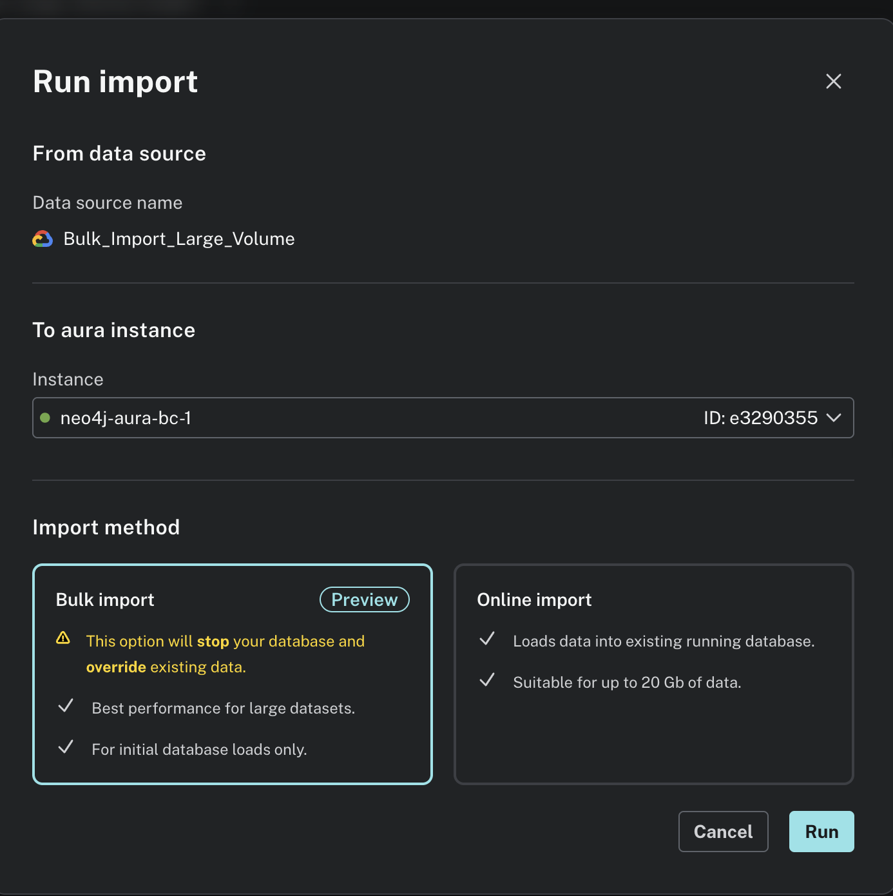
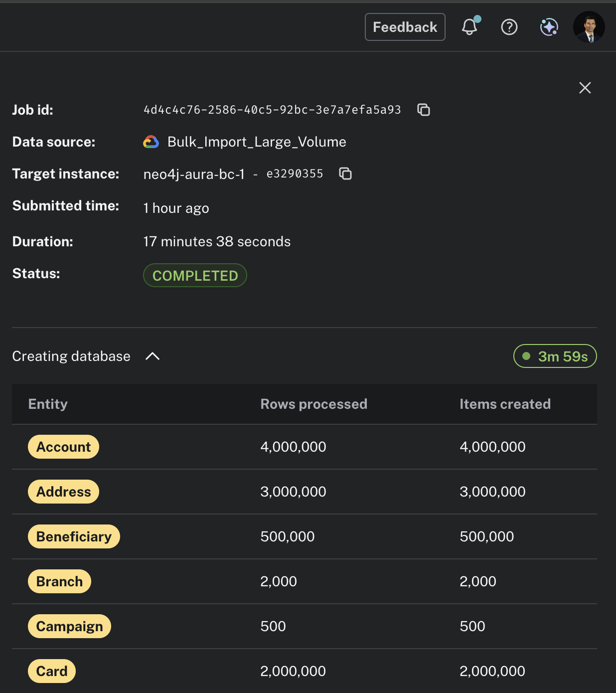
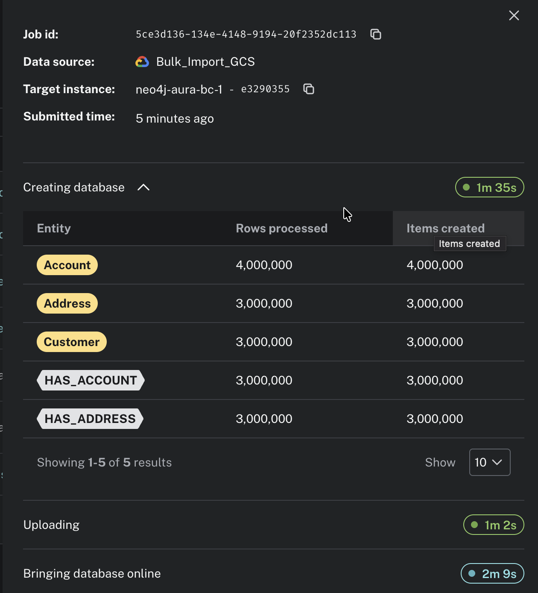

# Neo4j bulk load module

High-throughput parquet → Neo4j Aura loader, designed to fix the four most
common causes of transaction-memory pressure on large narrow-relationship
loads. Built on top of the official
[Neo4j Spark Connector](https://neo4j.com/docs/spark/current/installation/).

## Problem statement

A Neo4j customer is loading their graph from parquet and consistently
hitting the database's per-transaction memory limit on the relationship
phase. Their shape:

| | Customer | This benchmark (1/4 ratio) |
|---|---:|---:|
| Memory (Aura) | 128 GB | 32 GB |
| Node types | 22 | 22 |
| Total node rows | 136 M | 34 M |
| Relationship types | 33 | 33 |
| Total rel rows | 213 M | 53 M |
| Rel shape | 2-4 keys + insert_dtm | same |
| Node columns | up to 33 | up to 33 |

Node ingestion is fine for them. The pain is in relationships.

## Why transaction memory blows up on rel loads (and how this loader fixes it)

| Root cause | Fix in this loader |
|---|---|
| No unique constraint on node primary keys → every rel MERGE does a label scan, which serializes into the transaction. | `schema_setup.py` creates a unique constraint on every node PK before any data load. |
| Spark Connector default rel-write rebuilds full source/target nodes per batch. | `relationship.save.strategy=keys` forces a thin `MATCH(src{k}) MATCH(tgt{k}) CREATE` pattern. |
| `batch.size` set too high for nodes blows up transaction memory. | `--node-batch-size` (default 5000) and `--rel-batch-size` (default 5000) are surfaced separately for tuning. Empirically tested: 50000 vs 5000 rel batches produced no measurable difference on the test workload, since per-transaction work scales linearly with batch size on the receiver. The right value to ship is 5000 for both, with the flags surfaced for unusual workloads. |
| Forseti deadlocks on adjacent-node locks under any non-trivial rel-write parallelism. | Default `rel-partitions=1`. See **Two non-obvious gotchas** below. |
| Hot dimension targets (e.g. 5 RiskRatings shared by millions of rels) deadlock instantly. | `--hot-rel-threshold` (default 1000): rels whose target volume is below this auto-fall back to single-partition writes. |

## Two non-obvious gotchas (smoke test surfaced both)

These two bit us in the smoke test and would bite the customer too. Worth
calling out explicitly because neither is documented in the connector docs.

### 1. Random FK distribution causes Forseti deadlocks at ANY parallelism > 1

Source-key repartitioning isolates which Spark partition owns writes for a
given source node, but it does NOT prevent two partitions from writing rels
that share a target node. Every relationship write acquires
`EXCLUSIVE NODE_RELATIONSHIP_GROUP_DELETE` on both source AND target. With
random FK distribution, target overlap across partitions is statistically
guaranteed, and Forseti's deadlock detector kills one of the writers.

**Default to `rel-partitions=1` and only raise it after empirical testing
on your specific FK distribution.** Sparse rels (where each target has
~1 incoming rel) are safe to parallelize. Dense rels (where targets are
shared across many sources) are not.

### 2. Plain `local[*]` master silently ignores `spark.task.maxFailures`

Setting `spark.task.maxFailures=10` does nothing in `local[*]` mode. Any
task failure (including retriable `TransientException`) immediately aborts
the job. The fix is the documented but rarely-used `local[*,N]` master URL
syntax (where N is the per-task retry count). This loader uses `local[*,10]`.

In cluster mode (YARN, k8s, standalone) `spark.task.maxFailures` works as
expected, so this gotcha is local-mode-only.

## Architecture

```
        bulk_load/
        ├── config/data_model.yaml         (single source of truth — 22 nodes, 33 rels)
        │
        ├── src/generate_synthetic_data.py (reads YAML → writes parquet, vectorized numpy)
        ├── src/schema_setup.py            (reads YAML → creates unique constraints)
        ├── src/load_to_neo4j.py           (reads YAML + parquet → Spark Connector write)
        ├── src/aura_lifecycle.py          (Aura public API client: auth, CRUD, polling)
        ├── src/recreate_instance.py       (optional: delete + recreate Aura instance)
        │
        └── scripts/
            ├── provision_vm.sh            (idempotent VM bootstrap: Java, Python, jars)
            └── run_load_benchmark.sh      (orchestrates: [recreate] → wipe → generate → schema → load → CSV)
```

The YAML drives everything. Change a column type or volume in one place
and all three Python scripts pick it up.

## Trade-offs and design decisions

1. **Spark Connector over PyIngest.** At 87M rows, partition-level
   parallelism matters more than ops simplicity. PyIngest is a solid
   choice up to ~50M rows but leaves performance on the table above that.
2. **Local Spark mode, not EMR or a cluster.** Aura is the receiver and
   has 6 CPUs / one WAL. A bigger Spark cluster cannot push more
   throughput through the receiver. Local mode on a same-region VM
   gives full performance with zero cluster ops.
3. **Same-region VM, not laptop.** RTT to Aura drops from 30-80 ms to
   <1 ms. At 5K-row batches that is the difference between hours of
   network wait and minutes of actual database work.
4. **Generate parquet on the same VM, not S3/GCS.** The data is
   throwaway and the VM's local SSD is faster and cheaper.
5. **Unique constraints created BEFORE any load, not after.** Creating
   constraints after the data lands forces a full re-scan and is the
   slowest possible path.
6. **`batch.size` 5000 for both nodes and rels.** Nodes are wide, so
   5000 keeps per-transaction memory pressure off the receiver; bigger
   batches do not help. We initially shipped 50000 as the rel default
   on the hypothesis that the single-thread rel writer's bottleneck
   was sync round-trip count, but empirical testing showed no
   measurable difference between 5000 and 50000. Per-transaction
   work on the receiver (the MATCH+MATCH+CREATE per row) scales
   linearly with batch size, so bigger batches just take longer.
   Both flags are still surfaced for tuning workloads with unusual
   shapes (very wide rel properties, vector attributes), but the
   default is 5000.
7. **Synthetic data is intentionally `garbage-in`.** No faker, no real
   PII. The point is to exercise the load path at volume; the data
   semantics don't matter.

## Quick start (on the GCP us-east1 VM)

The VM provisioning command is in [`scripts/provision_vm.sh`](scripts/provision_vm.sh).
Once it has run on a fresh Debian 12 VM:

```bash
# Source the env updates (Spark Connector jar path, venv alias)
source ~/.bashrc
activate-bulkload

# Smoke test at 1% volume (~340K nodes, ~530K rels) first
SCALE=0.01 ./bulk_load/scripts/run_load_benchmark.sh ~/Neo4j-*.txt

# Full benchmark at 1.0x
./bulk_load/scripts/run_load_benchmark.sh ~/Neo4j-*.txt
```

## Tunable knobs (all surface as env vars)

| Var | Default | What it controls |
|---|---|---|
| `NODE_BATCH_SIZE` | `5000` | Rows per Bolt transaction for node writes. Wider rows; a modest value avoids transaction-memory pressure. |
| `REL_BATCH_SIZE` | `5000` | Rows per Bolt transaction for relationship writes. Tested 50000 vs 5000 on the same workload; throughput was effectively unchanged (~10K rows/sec either way). Per-transaction work scales linearly with batch size, so bigger batches do not compress the rel phase. Surfaced separately from node batch size for tuning workloads with unusual rel shapes. |
| `PARTITIONS` | `8` | Spark partitions for NODE writes. Nodes don't lock-contend, so saturate the writer side. |
| `REL_PARTITIONS` | `1` | Spark partitions for RELATIONSHIP writes. Default 1 to avoid Forseti deadlocks. Raise only after testing. |
| `HOT_REL_THRESHOLD` | `1000` | Rel types whose TARGET node count is below this force-fall back to 1-partition writes. |
| `NODE_MODE` | `merge` | `merge` is idempotent (uses upsert via `node.keys`); `create` skips upsert check, ~2x faster, fresh-load only. |
| `SCALE` | `1.0` | Multiplier on every YAML volume. Use `0.01` for a smoke test. |
| `WIPE_BEFORE_LOAD` | `auto` | Wipe the database before phase 2 by calling the parent directory's `reset_to_blank_neo4j_db.sh`. `auto` means wipe whenever load is happening on a non-fresh instance; `true` always wipes; `false` skips (e.g. for additive loads). |
| `RESET_SCRIPT` | `$MODULE_DIR/../reset_to_blank_neo4j_db.sh` | Path to the wipe script. Override only if you have moved the reset script. |
| `SKIP_GENERATE` | `false` | Reuse existing parquet. |
| `SKIP_SCHEMA` | `false` | Skip constraint creation. |
| `SKIP_LOAD` | `false` | Stop after generation/schema (e.g. for size-on-disk inspection). |
| `PARQUET_DIR` | `$HOME/data/parquet` | Where parquet lives. |
| `RESULTS_DIR` | `$HOME/results` | Per-run CSV + log directory. |

## Fresh-instance benchmarking (optional)

The lifecycle script automates a delete-and-recreate of the Aura instance
via the public API, useful when you want absolute confidence the target is
empty (e.g. when `reset_to_blank_neo4j_db.sh` itself is being changed and
you do not want to trust it as the wipe path), or when a tier change is
desired between runs.

It is **not** a path to faster benchmark numbers. We tested fresh-vs-warm
empirically and the difference was within run-to-run noise (see
[Findings](#findings-hypotheses-tested-empirically) below). For everyday
operations and benchmarking on the same tier, `reset_to_blank_neo4j_db.sh`
from the parent `general_utils/` directory is fine and an order of
magnitude faster than a delete-and-recreate.

`run_load_benchmark.sh` accepts an opt-in `RECREATE_INSTANCE=true` flag
that runs `src/recreate_instance.py` before phase 1. The lifecycle steps
are:

1. Authenticate to the Aura public API at `api.neo4j.io` using OAuth2
   client credentials.
2. Capture the target instance's full config (region, type, memory,
   cloud provider, plugin flags) so the new instance is byte-identical
   to the old.
3. Delete the existing instance and poll until it is gone.
4. Create a new instance with the captured config and poll until status
   is `running`.
5. Write the new connection URL and one-time password into a
   credentials file at `$FRESH_CREDS_FILE`. The rest of the run uses
   this file, regardless of which credentials were passed in
   positionally.

### Required environment variables

| Var | What it controls |
|---|---|
| `RECREATE_INSTANCE=true` | Opt-in switch; default off. |
| `AURA_API_CREDENTIALS` | Path to a file containing `CLIENT_ID` and `CLIENT_SECRET` for the Aura public API. Issued in the Aura console under Account → API keys. Same parsing format as the Neo4j DB credentials files used elsewhere in this repo. |
| `AURA_INSTANCE_ID` | The 8-character instance ID (e.g. `27ad415a`) to delete and recreate. Required; no fuzzy name matching. |
| `AURA_CUSTOM_ENDPOINT` | Optional. Printed in the recreate summary as a manual-rebind reminder. |
| `FRESH_CREDS_FILE` | Optional. Default `$HOME/Neo4j-fresh-credentials.txt`. Where the new instance's credentials are written (mode 0600). Any existing file at this path is moved to `.bak` before overwrite. |

### Custom endpoints are rebound manually

Custom endpoint binding is not in the lifecycle script. The Aura public
API returns `403 forbidden` on the custom-endpoints surface for the
OAuth keys provisioned for ordinary tenant operations, so the rebind
happens in the console: Custom endpoints → Configure → select the new
instance from the dropdown. One click. If `AURA_CUSTOM_ENDPOINT` is
set, the recreate summary prints a reminder with the endpoint URL and
the new instance ID so it is obvious what to point at.

### Example invocation

```bash
RECREATE_INSTANCE=true \
AURA_API_CREDENTIALS=~/Neo4j-credentials-Agent_Key.txt \
AURA_INSTANCE_ID=27ad415a \
AURA_CUSTOM_ENDPOINT="neo4j+s://custom-ep-pro-32-3rhw-9gff.endpoints.neo4j.io" \
./bulk_load/scripts/run_load_benchmark.sh ~/Neo4j-old-credentials.txt
```

The positional credentials file is still required (the script enforces
its existing CLI shape), but its contents are immediately superseded by
the freshly-written ones once the recreate completes. Total recreate
time is typically 5 to 10 minutes; the loader run starts as soon as the
new instance reaches `running`.

### Safety guardrails in the lifecycle script

`recreate_instance.py` is destructive. The defaults are conservative:

- `--instance-id` is required; there is no fuzzy name matching.
- Without `--yes`, the script prints the full instance config and
  requires the operator to retype the instance name to proceed.
- `--dry-run` shows the plan and exits without making any mutating
  call.
- The new credentials file is written with mode 0600. Any file at the
  output path is moved to `.bak` before overwrite, so a previous
  fresh-creds file is not silently destroyed.
- The one-time Aura password is shown only at create time. The script
  persists it before any further work; if the wait-until-running step
  later times out, the credentials file is still written so the
  operator can recover manually.

`run_load_benchmark.sh` invokes the script with `--yes` because the
benchmark runner is unattended. If you want the interactive prompt, run
`recreate_instance.py` directly first, then run `run_load_benchmark.sh`
without `RECREATE_INSTANCE=true` and pass the freshly-written
credentials file as the positional argument.

## Output

Each run writes:
- `results/load_<timestamp>_n<node-batch>r<rel-batch>_p<parts>_<mode>.csv` — per-table rows / seconds / rows-per-sec, plus a TOTAL row.
- `results/load_<timestamp>_*.log` — full run output for post-hoc analysis.

## Benchmark results

### Full run (100% scale, 93M rows)

Captured 2026-04-30 on n2-standard-8 (us-east1) → 32 GB Aura (us-east1),
end-to-end pipeline (generate → schema → load). Configuration:
`BATCH_SIZE=5000`, `PARTITIONS=8` (nodes), `REL_PARTITIONS=1` (rels),
`HOT_REL_THRESHOLD=1000`, `NODE_MODE=create`. Full per-table CSV in
[`results/full_run_b5000_p8_create.csv`](results/full_run_b5000_p8_create.csv).

| Phase | Rows | Wall time | Rate |
|---|---:|---:|---:|
| Generate parquet | 93.13 M | ~50 s | **1,860 K rows/sec** |
| Schema setup (22 unique constraints) | n/a | ~1 s | n/a |
| Load nodes (22 types) | 34.08 M | ~407 s (6.8 min) | **84 K rows/sec** |
| Load relationships (33 types) | 59.05 M | ~5,202 s (86.7 min) | **10.2 K rows/sec** |
| **Total (loader only)** | **93.13 M** | **5,609 s (93.5 min)** | **16,604 rows/sec** |
| **Total (end-to-end wall)** | **93.13 M** | **5,665 s (94.4 min)** | — |

**Aura health during the run** (from the Aura console):
- Page cache hit ratio: **99%+ sustained** for the entire 94 minutes
- Heap: max 67%, average 35-45% (healthy sawtooth, GC working cleanly)
- GC time: **0.008%** (essentially zero)
- Deadlocks / retries: **zero**

**Notable per-table observations:**
- Largest single rel: `HAS_TRANSACTION` (5 M rows) → 7:26 at 11.2 K rows/sec.
- Hot rels (tgt volume < 1000) ran at the **same or higher** throughput
  as non-hot rels, despite the forced 1-partition write. Small dimension
  targets stay fully cache-resident, so the MATCH side is essentially free.
  `VIA_CHANNEL_SES` (target Channel = 20 nodes) was the single fastest
  rel at 12.6 K rows/sec.
- Slowest rel: `FOR_CUSTOMER_LOAN` at 8.8 K rows/sec — the label
  transition (Loan source for the first time) paid a one-time
  cache-warm-up cost.
- Node phase peak: `Phone` at **107 K rows/sec** (narrow schema, 6 cols).

**Producer-vs-receiver attribution.** At 99% page cache hit ratio with
0.008% GC, the receiver was clearly not the bottleneck. The 10.2 K rows/sec
ceiling on the rel phase is producer-side: single-partition serialization
of writes through Bolt, with each batch of 5000 rows being a sync
round-trip that the receiver could absorb 2-3x faster if we sent more
of them in parallel. We chose serial writes for deadlock safety, and
that choice is the dominant cost.

### Customer extrapolation (their 213 M-rel workload on 128 GB Aura)

This is what the run lets us tell the customer:

| | Test run | Customer (projected) |
|---:|---:|---:|
| Aura tier | 32 GB / 6 CPU | 128 GB / 24 CPU |
| Total rows | 93 M | ~349 M (4x test) |
| Page cache headroom | 99% hit on test | More cache, even less pressure |
| Naïve linear projection | 94 min | **~6.3 hours** at our serial rate |
| Realistic with their CPU count | n/a | **2-3 hours** if rel-partitions tuned |

The 4x receiver capacity (24 CPU) doesn't translate to 4x throughput
because of the single WAL ceiling, but tuning `rel-partitions` from 1
to 4-6 on rels with low target overlap should give ~2-3x speedup. That
should be the customer's next experiment after the four core fixes are
in place.

### Smoke test (1% scale, validation only)

Earlier 1% smoke test (~931 K rows): 76 s wall, 13,090 rows/sec. Used
to validate the pipeline before committing 94 minutes of Aura time.
Smoke-test extrapolation underestimated the full-run rate by ~25%
because per-table fixed overhead amortizes better at scale.

## Findings: hypotheses tested empirically

After the baseline above, two hypotheses about the rel-phase bottleneck
were tested. **Both were rejected.** Recording the data here so future
operators can stop at the right experiment instead of re-running these.

All three runs use identical configuration except where noted:
n2-standard-8 in us-east1, against 32 GB business-critical Aura in
us-east1, `NODE_MODE=create`, `NODE_BATCH_SIZE=5000`, `REL_PARTITIONS=1`,
`SCALE=1.0`, 93,132,925 total rows.

### Three-run comparison

| Run | Date / time (UTC) | Wall time | Loader-only | Effective rate | Δ vs baseline (loader) |
|---|---|---:|---:|---:|---:|
| **Baseline** (warm BC, 5K rel batch) | 2026-04-30 01:51:55 → 03:26:20 | 5665 s | 5609 s | 16,604 rows/s | — |
| **Hyp 1: 50K rel batch** (wipe + load) | 2026-05-01 19:56:04 → 21:54:22 | 7098 s (incl 895 s wipe) | 6139 s | 15,172 rows/s | **−9.4 %** |
| **Hyp 2: fresh BC instance** (custom endpoint, no wipe) | 2026-05-02 10:10:11 → 11:46:46 | 5795 s | 5788 s | 16,090 rows/s | −3.2 % (within noise) |

Per-table CSVs are committed under `results/`:
[`full_run_b5000_p8_create.csv`](results/full_run_b5000_p8_create.csv),
[`load_20260501T195604Z_n5000r50000_p8_create.csv`](results/load_20260501T195604Z_n5000r50000_p8_create.csv),
[`load_20260502T101011Z_n5000r5000_p8_create.csv`](results/load_20260502T101011Z_n5000r5000_p8_create.csv).

### Hypothesis 1 (rejected): bigger rel batches compress the rel phase

**Theory.** With unique constraints pre-created and `relationship.save.strategy=keys`
in effect, each rel write is a thin `MATCH(src{k}) MATCH(tgt{k}) CREATE` with very
small per-row memory. The single-thread rel writer is bottlenecked on sync round-trip
count over Bolt; sending 10x more rows per round-trip should compress the rel phase
by close to 10x.

**Test.** Same pipeline, same data, only `--rel-batch-size 50000` instead of 5000.

**Result.** Rel phase: 5675 s at 50 K vs 5202 s at 5 K. **9 % slower, not faster.**
Per-rel rates moved a bit but stayed in the same band:

| rel | baseline 5 K | 50 K batch | fresh 5 K |
|---|---:|---:|---:|
| HAS_TRANSACTION (5 M rows) | 11,216 r/s | 9,524 r/s | 10,825 r/s |
| HAS_ACCOUNT (3 M) | 11,509 r/s | 9,370 r/s | 11,131 r/s |
| HAS_ADDRESS (3 M) | 10,996 r/s | 10,033 r/s | 10,582 r/s |
| VIA_CHANNEL_TXN (3 M) | 12,527 r/s | 12,219 r/s | 12,617 r/s |
| IN_CURRENCY_TXN (3 M) | 12,278 r/s | 12,185 r/s | 12,868 r/s |
| FOR_CUSTOMER_SES (3 M) | 9,768 r/s | 8,888 r/s | 10,147 r/s |

**Why the theory was wrong.** Per-transaction work on the receiver (the `MATCH src`
+ `MATCH tgt` + `CREATE rel` per row, plus index updates and lock acquisition)
scales linearly with batch size. A 10x bigger batch reduces round-trip count by
10x, but each transaction also takes 10x longer. Net throughput is unchanged in
the best case and slightly worse here, likely because larger transactions have
slightly more overhead in commit/flush.

### Hypothesis 2 (rejected): a fresh instance outperforms a wiped-and-reused one

**Theory.** A brand-new Aura instance has no warm page cache, no stale schema
fragments, no fragmentation history. Loading into a fresh instance should give a
cleaner baseline and possibly faster numbers than reusing a wiped instance.

**Test.** Created a new 32 GB business-critical Aura in us-east1, pointed an
existing custom endpoint (`custom-ep-pro-32-3rhw-9gff.endpoints.neo4j.io`) at
it, and ran the same pipeline against the new instance with `WIPE_BEFORE_LOAD=false`
(the new instance was already empty by construction). Custom-endpoint routing
verified resolving to `ingress.production-orch-1174.neo4j.io` and `cypher-shell`
returning `0` for `apoc.meta.stats()` before launch.

**Result.** Loader wall: 5788 s vs 5609 s baseline. **3 % difference, within
run-to-run noise.** Per-rel rates (column "fresh 5 K" above) sit on top of the
warm baseline.

**Why the theory was wrong.** A wiped instance is empty by definition once the
reset script finishes (constraints dropped, all rels deleted, all nodes deleted,
count store stats=0). Whatever residual heap state, page cache, or fragmentation
history exists on the JVM does not materially affect throughput on the rel-write
path, because the receiver's per-row CPU cost dominates everything else and that
cost is the same on both substrates.

### What this tells us about the actual bottleneck

The rel phase ceiling on this workload is **per-row CPU work on the Aura
receiver**, not transaction memory, not round-trip count, not page cache warmth,
not fragmentation. Things that change those four variables do not change
throughput meaningfully. Per-rel rates across all three runs cluster between
~9,500 and ~13,000 rows/sec, regardless of batch size, instance freshness, or
which one ran first.

The single lever that was already flagged in the README's [Two non-obvious
gotchas](#two-non-obvious-gotchas-smoke-test-surfaced-both) section, but not
yet exercised, is **parallelism via `--rel-partitions`**. That experiment
is non-trivial because Forseti deadlocks on shared target nodes are a real
risk at any rel-write parallelism > 1 with the default random FK distribution.

The much bigger lever — and the one that actually unlocks the customer's
target performance — is to bypass the Bolt write path entirely. See
**Hypothesis 3 (validated)** below.

### Hypothesis 3 (VALIDATED): Aura Bulk Import via console-preview + GCS parquet

**Theory.** The Bolt path's per-row CPU cost on the receiver is invariant to
anything the loader can change. Aura's **Bulk Import** ([public preview
changelog](https://neo4j-aura.canny.io/changelog/bulk-import-for-aura-public-preview))
sidesteps Bolt entirely: it builds the database store files offline from
parquet/CSV staged in cloud storage and the database mounts them. Documented
3x speedup on small datasets, **10x+ at >100 GB**.

**Test.** Same 93 M rows, same NODE_MODE-equivalent semantics (initial load),
same target instance e3290355 (32 GB BC us-east1). Source: all 22 node and
33 relationship parquet files staged in `gs://dataflow-demo-guhan/admin-import-test-data/`,
authored as a model in `console-preview.neo4j.io`, executed via the console UI's
**Bulk import** option ("This option will stop your database and override
existing data").

**Result: 17 minutes 38 seconds wall, end-to-end, COMPLETED.** All 93,132,925
items landed. **5.3x faster than the 5,609 s Bolt baseline.**

| | Wall time | Effective rate | vs baseline |
|---|---:|---:|---:|
| Bolt Spark Connector (5K rel batch) | 94 min (5,609 s) | 16,604 rows/s | — |
| **Aura Bulk Import (this run)** | **17 min 38 s (1,058 s)** | **88,028 rows/s** | **5.3x faster** |

Phase breakdown captured in the result screenshot:

- Creating database: 3 min 59 s (scales linearly with row count: was 1 min 35 s for 16 M rows)
- Uploading: ~1-2 min (mostly fixed cost)
- Bringing database online: ~2-3 min (fixed cost)

#### The full workflow, end to end

**Step 1: model authoring in the Aura console (`console-preview.neo4j.io` → Import).**
The data source `Bulk_Import_Large_Volume` (the GCS-staged parquet bucket
registered with HMAC credentials) is on the left. The graph canvas in the
center shows all 22 node types + 33 relationship types laid out and connected.
The right panel is the per-node property mapping; visible here are the
Customer node's properties mapping each graph token (e.g. `customerId`) to
its parquet column (`customer_id`).


**Step 2: select the import method.**
"Run import" surfaces both options. **Bulk Import** is explicitly labeled
*"This option will stop your database and override existing data"* — the
destructive semantic that the spec also documents. Picking this and clicking
"Run" is the entire trigger today.



**Step 3: result.**
Job `4d4c4c76-2586-40c5-92bc-3e7a7efa5a93` against instance `e3290355`,
**17 min 38 s wall time, status COMPLETED**. The Creating database phase
took 3 min 59 s for the full 93 M-row schema; the rest is upload and
bring-online.



**Supporting evidence — partial run for the linear-scaling argument:**


*A 5-entity partial run (Customer + Account + Address + 2 rels = 16 M items)
finished in 5 min total. Creating database was 1 min 35 s for that subset,
which extrapolates linearly to the 3 min 59 s observed at the full 93 M scale.*

**Customer extrapolation.** At their 213 M-row workload on 128 GB Aura, Bulk
Import is projected to land in **30-40 min**, vs the 6+ hours the Bolt path
would require. The performance ceiling we identified for the Bolt approach
(per-row CPU on the receiver) is precisely what Bulk Import does not pay,
because store files are constructed offline rather than written through
transactions.

### The architecture answer for the customer's regular workflow

```
[customer's data engineer]
   └── Authors the Bulk Import "model" once per schema version
       in console-preview.neo4j.io (the editor that produces public-API
       compatible models for the import service). Saved server-side; gets
       a stable model_id.

[customer's pipeline]
   ├── Stages parquet in GCS / S3 / Azure Blob (the Bulk Import data source
   │   they registered, e.g., `gs://<bucket>/<prefix>/{nodes,relationships}/*.parquet`)
   ├── Authenticates: OAuth2 client credentials at api.neo4j.io/oauth/token
   │                  using their Aura API key (CLIENT_ID + CLIENT_SECRET)
   ├── POSTs https://api.neo4j.io/v2beta1/organizations/{org}/projects/{proj}/import/jobs
   │   with body { importModelId, auraCredentials.dbId, importConfig.importType: "initial" }
   ├── Polls https://api.neo4j.io/v2beta1/.../import/jobs/{jobId}?progress=true
   │   until info.state ∈ {Completed, Failed, Cancelled}
   └── Done — fully programmatic. The customer never touches the console
       except when the schema itself changes.
```

`importType` values (per the [official v2beta1 spec](https://neo4j.com/docs/aura/platform/api/specification/aura_api_spec_v2beta1.yaml)):
- `initial` — **destructive bulk import.** Overwrites the entire database.
  Spec is explicit: *"Warning: bulk imports overwrite all existing data in the
  database."* This is the path for first-time loads and periodic full refreshes.
- `online` — additive incremental import. For ongoing CDC-style updates.

Two scripts are committed alongside this README to make the path concrete:

- `bulk_load/src/fire_import.py` — submits a job, polls until terminal,
  prints final wall time. Designed to be the customer's pipeline-grade
  trigger.
- `bulk_load/src/aura_lifecycle.py` — adds `submit_import_job`,
  `get_import_job`, `wait_for_import_job` methods to `AuraClient`. The trigger
  script is a thin wrapper on top.
- `bulk_load/scripts/captured_console_import_request.json` — the canonical
  reference for the request body shape (verbatim capture from the console's
  network tab during a successful UI-triggered run).
- `bulk_load/scripts/gcs_parquet_file_list.txt` — the 55-file "name, gs://uri"
  list the customer uses to register their cloud data source.

### Open issue blocking full automation today

The 17 min 38 s run was triggered through the **console UI**, which submits
the model inline to a console-internal endpoint. The **public Aura API**
(`POST api.neo4j.io/v2beta1/.../import/jobs`) takes only an `importModelId`
and looks the model up from server storage. With our existing OAuth2 client
credentials, the public API responds:

```
HTTP 400
"Error deserializing Model V3.0:
 kotlinx.serialization.json.internal.JsonDecodingException:
 Expected JsonObject, but had JsonLiteral
 as the serialized body of GraphSchemaVersion at element: $.graphSchemaRepresentation"
```

Reproducible across multiple cloud-source models from both
`console.neo4j.io` and `console-preview.neo4j.io`. Local-source models
deserialize cleanly through the public API; cloud-source models do not.
This is a server-side mismatch between how the storage layer serializes
`graphSchemaRepresentation` (as an escaped JSON string) and how the public
API's deserializer reads it (as a JSON object).

**The customer's pipeline code (`fire_import.py`) is ready and waiting.**
The script's `POST` body, headers, polling logic, and error handling all
work — verified by submit-time validation responses. The moment Neo4j
fixes the server-side deserialization, the same script runs end-to-end with
no code changes.

A focused support ticket with that exact reproduction is the unblocker.
Bypassing this with a session-token automation against the console-internal
API is technically possible but is brittle (15-minute Auth0 tokens, manual
refresh, undocumented endpoint) and not recommended for production.

## Recommendations applicable to the customer's production load

These translate directly to their 128 GB / 24 CPU / 213 M rel environment:

1. **Run the loader from a VM in the same region/zone as the Aura instance.** Pre-test, this alone is often a 5-10x speedup.
2. **Pre-create unique constraints on all node PKs before any load.** Even if the loader does it, surface this as an explicit pre-step so it isn't accidentally skipped.
3. **Always set `relationship.save.strategy=keys`.** This is the single biggest connector option for narrow-rel loads.
4. **Keep `batch.size` at 5000 for both nodes and rels.** We initially shipped 50000 as the rel default on the theory that bigger batches would compress sync round-trips on the single-thread writer. Empirically, no measurable difference vs 5000: per-transaction work on the receiver scales linearly with batch size, so bigger batches just take longer. Surface the flag for unusual workloads (very wide rel properties, vectors); ship 5000 by default. The dominant lever for the rel phase is parallelism, not batch size, and parallelism is constrained by Forseti deadlocks on shared target nodes (see `--rel-partitions`).
5. **Repartition on the source key before write.** A few extra seconds of shuffle pays itself back many times in reduced lock contention.
6. **Load all nodes before any relationships.** The MATCH on the rel side is only fast if the source/target nodes already exist.

## Environment and Aura-side fine-tuning

The four code-level fixes above solve the transaction-memory problem, but they are not the whole picture. The recommendations below are environmental and Aura-side knobs that compound on top of the loader fixes. Each is individually worth 10-30%; together they are the difference between a clean 2-3 hour customer run and one that fights the platform the whole way.

1. **Colocate the loader with Aura at the network level.** Same region is mandatory. Same zone shaves another fraction of a millisecond off RTT and is free if you can pick it. On Aura Enterprise or Virtual Dedicated Cloud, use Private Service Connect (GCP) or PrivateLink (AWS) to put a private endpoint inside your own VPC so the load traffic never touches the public internet. Bolt is a synchronous request/response protocol, so at 5000-row batches every batch is a round-trip. Going from cross-region (30-80 ms RTT) to same-region (<1 ms RTT) is the largest single non-code speedup we measured, often 5-10x.

2. **Size the VM for the producer side, not the receiver.** Node writes use 8 Spark partitions by default, so any VM with 8 or more vCPUs keeps the writer side saturated. Relationship writes default to a single partition for deadlock safety, but the JVM still needs memory headroom for batch buffering and the Spark driver. For a 32 GB Aura, `n2-standard-8` is enough; for the customer's 128 GB Aura, step up to `n2-standard-16` so there is room to raise `rel-partitions` above 1 once their FK distribution is characterized. Local SSD for the parquet directory is non-negotiable; network-attached storage caps generation throughput at a fraction of what local NVMe delivers.

3. **Disable CDC during the initial load.** Change Data Capture writes a second stream of change events to the transaction log on every commit. On a narrow relationship load that already pressures transaction memory, CDC compounds the cost and reduces effective batch capacity. Turn CDC off in the Aura console for the load window and re-enable it once the bulk load is complete. Downstream consumers can be backfilled from the loaded data separately; they do not need to see the load itself as a change stream.

4. **Quiesce secondaries and read replicas.** Aura secondaries replay the primary's transaction log. Heavy reads on them during a bulk load both consume cluster bandwidth and create backpressure on the primary if they fall behind the WAL stream. Pause application traffic to secondaries for the load window, or detach and reattach them after.

5. **Defer fulltext and vector indexes until after the data is loaded.** The unique constraints created by `schema_setup.py` are range/btree indexes and are cheap to maintain at write time. Fulltext (Lucene) and vector (HNSW) indexes are not. Every insert triggers a Lucene segment write or HNSW graph update, and that overhead does not show up in the per-transaction memory numbers because it lives on a separate write path. Create search and vector indexes once the data has landed; index population over an existing dataset is consistently faster than online maintenance during a 100 M-row load.

6. **Minimize log verbosity for the load window.** Set query log and security log levels to `WARN` or `ERROR` in the Aura console for the duration of the load. At 5000-row batches, an 87 M-row relationship phase produces roughly 17,500 transactions for relationships alone. Per-transaction log lines are not free at that volume and they share I/O bandwidth with the WAL.

7. **Schedule around the backup window.** Aura takes scheduled snapshots. They are throttled and rarely visible, but on a 90-minute load that overlaps with a snapshot you can see a 10-20% throughput dip. Check the backup schedule in the Aura console and run the load between windows when the option is available.

8. **Start every benchmark from a known clean state.** Stale constraints, partial indexes, or leftover nodes from a prior failed attempt produce inconsistent timings and obscure which run is the real baseline. `run_load_benchmark.sh` does this automatically as phase 1 of every run via `WIPE_BEFORE_LOAD=auto`, which calls `reset_to_blank_neo4j_db.sh` from the parent `general_utils/` directory. The wipe is auto-skipped only when `RECREATE_INSTANCE=true` (the new instance is empty by construction). Set `WIPE_BEFORE_LOAD=false` only when you intend to append to an existing graph.

9. **Run during a quiet window for the primary's application traffic.** Concurrent OLTP workload during the bulk load competes for page cache and CPU on the primary. Read queries do not conflict with writes at the lock level, but the 99% page cache hit ratio observed in our test assumed an idle instance. With mixed workload, cache hit drops, and every label lookup on the relationship-write path becomes more expensive. If a full maintenance window is not feasible, schedule the load for the lowest-traffic hours available.

## Not in scope (for now)

- PyIngest variant. Documented as an alternative but not implemented.
- Online deltas / CDC. This is initial-load only.
- Multi-database write. Single Aura instance.
- neo4j-admin import. Not available on Aura.
